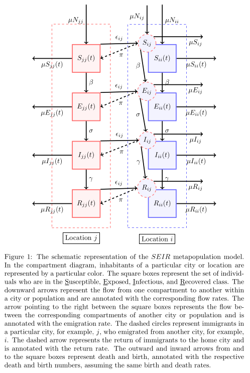

# High connectivity and human movement limits the impact of travel time on infectious disease transmission

**Note:** _Even though the schematic diagram plots Location j as the home location, with people moving to all other Locations i and then returning to home location j, the code is actually written with Location i as the home location, where people move to all other Locations j and then return to home location I._

  

## Abstract

The speed of spread of severe acute respiratory syndrome coronavirus 2 (SARS-CoV-2) during the coronavirus disease 2019 (COVID-19) pandemic highlights the importance of understanding how infections are transmitted in a highly connected world. Prior to vaccination, changes in human mobility patterns were used as non-pharmaceutical interventions to eliminate or suppress viral transmission. The rapid spread of respiratory viruses, various intervention approaches, and the global dissemination of SARS-CoV-2 underscore the necessity for epidemiological models that incorporate mobility to comprehend the spread of the virus. This repository presents a metapopulation susceptible-exposed-infectious-recovered (SEIR) model parameterized with human movement data from 340 cities in China. The model replicates the early case trajectory in the COVID-19 pandemic. Additionally, machine learning algorithms have been employed to determine which network properties best predict spread between cities, with travel time identified as the most influential factor, followed by the human movement Weighted Personalised PageRank. Furthermore, the research demonstrates that travel time has the most significant impact locally, and the high connectivity between cities reduces the impact of travel time between individual cities on transmission speed. Finally, the study shows that only significantly reduced movement substantially impacts infection spread times throughout the network.

## Introduction

The COVID-19 pandemic has emphasised the critical role of understanding how infectious diseases spread, particularly in a highly interconnected world. In this context, human mobility patterns have been used as non-pharmaceutical interventions to curb the transmission of viruses. This repository presents a comprehensive study that combines a metapopulation SEIR model with human movement data to analyze the spread of SARS-CoV-2 in 340 cities across China.

## Features

- Metapopulation SEIR model for studying disease spread
- Human movement data from 340 cities in China
- Machine learning algorithms to identify influential network properties
- Impact analysis of travel time and human movement Weighted Personalised PageRank on transmission speed
- Investigation of reduced movement effects on infection spread times

## Conclusion

This repository provides a comprehensive study of COVID-19 spread and mobility modelling, utilising a metapopulation SEIR model and human movement data from 340 cities in China. The analysis incorporates machine learning techniques to identify influential network properties and highlights the significance of travel time and human movement Weighted Personalised PageRank on transmission speed. By understanding the impact of reduced movement on infection spread times, the research contributes to our comprehension of COVID-19 transmission dynamics in a highly connected world.

For any inquiries or collaborations, please contact [rejusamjohn@gmail.com](mailto:rejusamjohn@gmail.com).

## License

This project is licensed under the [MIT License](LICENSE).
